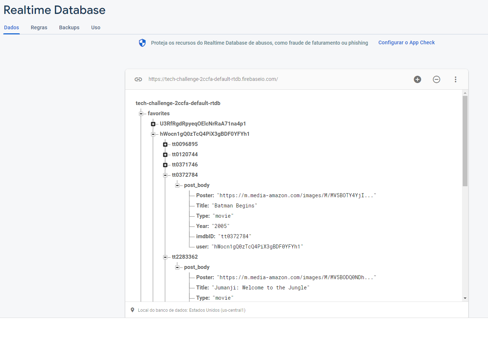

# tech-challenge

This was one of the hardest challenges I've done. It was a full Crud with several tasks, but, we're here for the challenge.

### DEPLOY

This project was deployed in [Heroku](https://id.heroku.com/login).

It has 2 applications, one for the ```front-end``` link: https://tech-challenge-frontend.herokuapp.com/ in React and also one for the ```back-end``` link: https://tech-challenge-backend.herokuapp.com/ in NodeJs.

The current github repositories are:

https://github.com/julioclopes32/tech-challenge-frontend

https://github.com/julioclopes32/tech-challenge-backend

### Database

For this project, I choose to use the Firebase Database, it's a nice solution, easy to use, with several tools and also, it's a noSQL JSON formatted database
<br/>

<br/>
, and that was  my main concern, with firebase it's really easy to store and retrieve JSON data because we don't have to treat the data, we can just store as it's as the same as recover the data.

### Cache

I used the nodejs memory-cache to manage the movie research key-word savings in cache.

link: https://www.npmjs.com/package/memory-cache

It's really simple to use, as it stores the data in a hashmap format, making simple to store data in cache.

### Concept-map

The bigger the problem, the harder it's to join all the ideas and not get lost during the development. To help with the process I made a concept map, on it, we can discuss about my ideas and how I faced the solution.
<br/>

<br/>
Looking at the concept map we can see that the application has a Front-end and a Back-end.
I kind of lost a lot of time in the Front-End because I wanted to get the best result and also learn with this challenge.
Basically, There are 5 pages in the front end, the login and register, which are managed by the firebase database.
The Favorite movie page, the research and result pages.

Each one of them is integrated to the back-end with APIs in a NodeJS application.

### Integration
Now I'll be more technical about the project. Basically, the Front-End starts in the login page. It uses routes to move between pages and the firebase authenticator to manage the login and password storage as well as the verification, I only do the input treatment and send a request directly to firebase.

Once logged in, the Front-End itself manages the session, with session persistence in all pages. Unfortunately when refreshing the pages, the Front-End redirects to login page, this happens, because the user variables go to null when refreshing the page. Access null values may crash the application, so, it redirects to login page before crashing.

When logged, the home page is the search page, with a nice input to look for movies, on submit the search the app goes to the result page, with a movie query on link, if the value is too short, the application won't search because the own API doesn't send results that exceed a big number of movies.

On result page, the movie query is sent in a GET method ```/results``` and it returns the keyword search data. On backend, the server looks for the data in cache then in firebase database, then it looks on imdb API. if not found in any of the steps it stores the data in cache in hashmap keyword and in firebase database.

So, as said, the Front-End receives from the result data, and show as a list. Once decided which are the favorites, on click, the Front-End sends a POST method ```/favorite``` to store the data in the firebase database. 

In the Favorite List, the Front-End sends a GET method ```/getfavorite``` to receive the data in the firebase database, and it waits to display on the page. In this part, It was necessary to async render, because, the page can only render after the GET method returns the favorite list.

Once rendered, it is possible to remove a movie from the favorite list, on click to remove, the the Front-End sends a POST method ```/removefavorite``` to remove the data from firebase database.

### How It Works?
Well, it's really simple to use this app, first access the ```front-end Website```: http://tech-challenge-frontend.herokuapp.com/ in heroku.

go in register, go back to the login screen, authenticate, search for a movie and add to the favorite list.

the application is functional and deployed, I did my best to reach a good UI/UX.

### Improvements

Well, I finished this project, it's completely functional and I did all the improvements to reach a good UI/UX, as well as make the Frontend/Backend integration efficient.

The only thing that I would change it's the backend development process. Change between the backend in localhost and heruko required a lot of changes in code, because of that I developed the front end in localhost, but the backend I did directly in heroku, because of that I had to deploy everytime I did a change, and it caused the number of deploys to became just too big. In a real situation, with a real product, it wouldn't be fit to do soo many deploys.

### Conclusion

Well, It was hard, but, I did my best ! I focused in having a good looking and functional application, with login and logout system as well as a nice Front-End.
